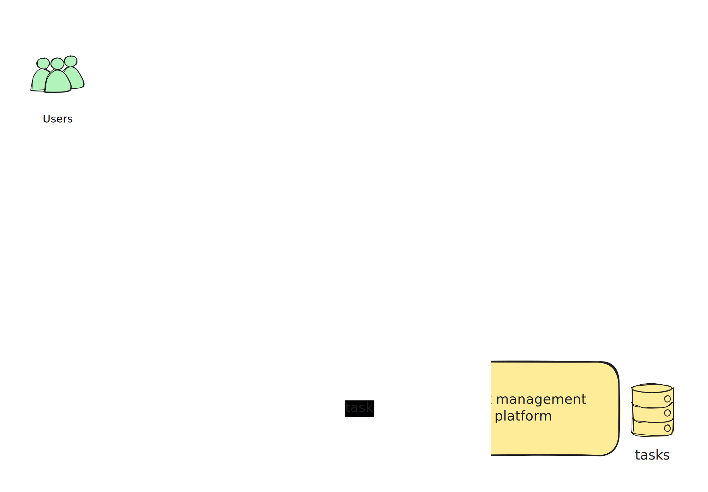

# Taskflow Agent 2.0 (Event-Driven MVP)

A scalable, event-driven service that automatically creates actionable tasks from real-time conversations using RabbitMQ and AI-powered task extraction.

---

## 🎯 MVP Features

- **📝 Message Ingestion**: Submit conversation messages through CLI or web UI
- **🤖 AI Task Extraction**: Rule-based task extraction (expandable to LLM)
- **🏗️ Task Management**: Simulated task creation in various platforms
- **⚡ Event-Driven**: RabbitMQ-based microservices architecture
- **🌐 Web Interface**: Streamlit frontend for easy interaction

---

## 🏗️ Architecture

```
[Ingestor Service] ---(RabbitMQ)---> [AI Task Extractor] ---(RabbitMQ)---> [Platform Manager]
        |                                     |                                    |
   Message Input                        Task Extraction                    Task Creation
   (CLI/Web UI)                        (Rule-based AI)                  (Console/Mock)
```

**Event Flow:**
1. **Ingestor** publishes `conversation.message_received` events
2. **AI Extractor** subscribes to messages, extracts tasks, publishes `task.extracted`  
3. **Platform Manager** subscribes to tasks, creates them, publishes `task.created/failed`

---

## Service Architecture

Below are the architecture diagrams for the Taskflow Agent services:

### Services Design



### AI Service


---

## 🚀 Quick Start

### Prerequisites
- Python 3.11+
- RabbitMQ (local or cloud instance)

### Installation

1. **Clone and setup:**
```bash
git clone <repository>
cd taskflow-agent
```

2. **Install dependencies:**
```bash
uv sync
# or: pip install -e .
```

3. **Start RabbitMQ:**
```bash
# Using Docker (recommended)
# latest RabbitMQ 4.x
docker run -it --rm --name rabbitmq -p 5672:5672 -p 15672:15672 rabbitmq:4-management

# Or install locally: https://www.rabbitmq.com/download.html
```

4. **Run the application:**
```bash
# Option 1: Run all services (recommended for demo)
python run_service.py all

# Option 2: Run individual services
python run_service.py extractor     # AI task extractor
python run_service.py platform_manager  # Task creator
python run_service.py frontend      # Web UI
python run_service.py ingestor      # CLI message input
```

---

## 🌐 Using the Web Interface

1. **Start all services**: `python run_service.py all`
2. **Open browser**: http://localhost:8501
3. **Submit messages**: Use the form to enter conversation messages
4. **View tasks**: See extracted tasks appear in real-time

### Example Messages to Try:
- "We need to fix the login bug by Friday"
- "Can someone please review the new design?"
- "@john please update the documentation ASAP"
- "Let's schedule a meeting tomorrow to discuss the project"

---

## 📋 Service Commands

```bash
# Run specific services
python run_service.py ingestor          # CLI message input
python run_service.py extractor         # Task extraction service
python run_service.py platform_manager  # Task creation service
python run_service.py frontend          # Streamlit web UI
python run_service.py all              # All services

# With custom log level
python run_service.py all --log-level DEBUG
```

---

## ⚙️ Configuration

Create `.env` file (optional):
```bash
cp .env.example .env
```

**Environment Variables:**
```bash
RABBITMQ_HOST=localhost
RABBITMQ_PORT=5672
RABBITMQ_USERNAME=
RABBITMQ_PASSWORD=
RABBITMQ_EXCHANGE=taskflow
LOG_LEVEL=INFO
```

---

## 🧪 Testing the MVP

### Method 1: Web Interface (Easiest)
1. Run: `python run_service.py all`
2. Open: http://localhost:8501
3. Submit test messages and watch tasks appear

### Method 2: CLI Services
1. **Terminal 1**: `python run_service.py extractor`
2. **Terminal 2**: `python run_service.py platform_manager`  
3. **Terminal 3**: `python run_service.py ingestor`
4. Enter messages in Terminal 3, watch tasks appear in Terminal 2

---

## 📊 What's Included

### ✅ Backend Services
- **Ingestor**: Message ingestion with RabbitMQ publishing
- **AI Extractor**: Rule-based task extraction from messages
- **Platform Manager**: Mock task creation with console output
- **Messaging**: RabbitMQ utilities with event schemas

### ✅ Frontend
- **Streamlit UI**: Message submission and task viewing
- **Real-time Updates**: See extracted tasks as they're created

### ✅ Infrastructure
- **Event Schemas**: Structured event definitions
- **Configuration**: Environment-based settings
- **Service Orchestration**: Run individual or all services

---

## 🔮 Next Steps (Beyond MVP)

- **LLM Integration**: Replace rule-based extraction with GPT/Claude
- **Real Platforms**: Integrate with Trello, ClickUp, Jira APIs
- **Live Sources**: Slack/Teams webhooks for real-time ingestion
- **Advanced UI**: React frontend with real-time WebSocket updates
- **Persistence**: Database storage for tasks and audit trails
- **Authentication**: User management and multi-tenancy
- **Monitoring**: Observability, metrics, and alerting

---

## 🏗️ Project Structure

```
taskflow/
├── backend/
│   ├── ingestor/           # Message ingestion service
│   ├── extractor/          # AI task extraction service  
│   ├── platform_manager/   # Task creation service
│   ├── utils/              # Shared utilities (messaging)
│   ├── config/             # Configuration management
│   └── main.py             # Service orchestration
├── frontend/
│   └── app.py              # Streamlit web interface
└── shared/
    └── events.py           # Event schemas and serialization
```

---

## 🤝 Contributing

1. Fork the repository
2. Create a feature branch
3. Add tests for new functionality  
4. Submit a pull request

---

## 📄 License

MIT License - see LICENSE file for details

---

**🚀 Ready to extract tasks from conversations? Run `python run_service.py all` and visit http://localhost:8501 to get started!**
